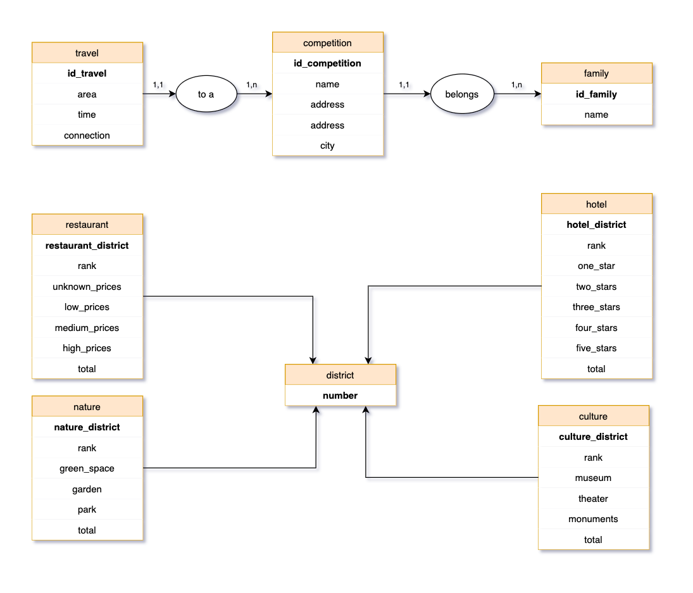

# Argumentaire - Expertise Back-End

*Pierre SECHER*

Ce fichier *README* présente les **explications techniques** du repo.

## Modélisation de base de données

### Récupération de la donnée

Nous nous sommes appuyés sur diverses sources pour récupérer nos données :
  - Google Maps Platform - [Direction API](https://developers.google.com/maps/documentation/directions/start)
  - Paris Data - [Espaces verts et assimilés](https://opendata.paris.fr/explore/dataset/espaces_verts/information/?disjunctive.type_ev&disjunctive.categorie&disjunctive.adresse_codepostal&disjunctive.presence_cloture)
  - data.gouv.fr - [Hôtels classés](https://www.data.gouv.fr/fr/datasets/la-carte-des-hotels-classes-en-ile-de-france-idf/)
  - Kaggle / TripAdvisor - [Restaurants](https://www.kaggle.com/damienbeneschi/krakow-ta-restaurans-data-raw/version/5)

Une fois ces différentes sources exploitées, nous avons mis en forme les données extraites suivant ce **Modèle Conceptuel de Données** : 

 - La première partie de ce modèle se concentre sur la fonction clé du service: **la récupération du temps de parcours** entre les 20 arrondissements de Paris et les différentes compétitions des **JO de Paris 2024**.

 - La seconde partie concerne les **points d'attraits** de ces arrondissements : la restauration, la nature, la culture et l'hôtellerie.

### Relations

Prenons pour exemple la relation **OneToMany** qui relie les tables `competition` et `family`.

Chaque compétition appartient **à une et une seule** famille (cardinalité 1,1), tandis qu'une famille peut regrouper **une ou une infinité** de compétitions (cardinalité 1,n).

En base de données, la table `competition` aura alors une colonne `id_family`.

## Symfony & API Platform

Avec notre [système d'hydratation](https://github.com/InSecker/jo-server/tree/master/utils/data_hydrator) de la base de données, l'API n'a plus qu'à renvoyer une information qui est déjà formatée suivant les usages du front. L'utilisation d'API Platform étant donc évidente, puisqu'il n'y aurait plus qu'à y configurer quelques paramètres :

  - Autoriser uniquement les requêtes en **GET**
  - **Groupes de sérialisation**, pour ne renvoyer que les champs désirés (ne pas renvoyer des champs d'ID par exemple)
  - Customisation des noms de sérialisation

Une **documentation d'API** est générée par API Platform à cette url : [http://localhost:8000/api](http://localhost:8000/api)
